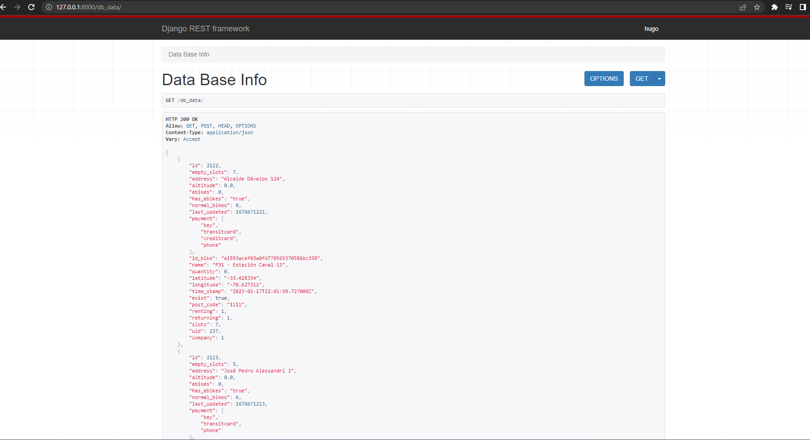

# chr_test

### Notas.

- el archivo Main contiene el programa principal el cual inicia la obtencion de los datos y enviar estos a los modelos
- comenzar en el archivo main y correr script , seguir las instrucciones en consola y seleccionar alguna de las opciones del menu
- Se una una instancia de AWS-RDS que contiene la base de Datos PostgresSQL

### Descripcion.

El siguiente proyecto es la realizacion de dos tareas presentadas
en el documento enviado por correo electronico 
las tareas son las siguientes:

### Tarea 1

Dada la siguiente API pública http://api.citybik.es/v2/networks/bikesantiago (Bike Santiago)
desarrolle los siguiente requerimientos:

- Crear una función que obtenga la información presentada en la API pública (librerías
a utilizar: requests, urllib3 o aiohttp).

Por medio de la libreria request obtuve toda la data de la API , luego de analizar la estructura json de la api con 
postman fui creando distintas listas, las que luego transforme en un dataframe de pandas con la estructura definida para 
los nuevos modelos de Django.Por medio de sqlAlchemy se crea la conexion con la base de datos y se envian los datos a la
db, use este metodo por que simples queries son demasiado lentas, en cambio usando un dataframe en segundos se envian los datos

- Crear un modelo para la información obtenida.

analizando la informacion defini dos modelos uno llamado company y otro llamado stations, los que representan la compañia madre
y cada una de las estaciones donde se encuentran objetos de l API , y cada estacion tiene una relacion con la compañia madre

- Guardar en el modelo la información obtenida desde el API.

por medio del dataframe creado envie la informacion de la API a la base de datos, , usar los modelos de Django , tambien es demasiado lento 

- Opcional. Generar vista en el administrador para visualizar la información obtenida.

Cree una vista personalizada en el admin de Django para visualizar la informacion obtenida de la API, como si fuera una 
base de datos con columnas y filas, ademas de un filtro y una barra de busqueda
ver imagen Adjunta al final del documento

- Opcional. Generar una vista con la información en Bootstrap 5 u otro similar.
genere una vista de la informacion de la base de datos usando restframework con la nueva estructura que defini en los modelos 
ver imagen Adjunta al final del documento

Creacion de una nueva vista en admin para visualizar la informacion obtenida de la API

Creacion de una Api por medio de restframework para entregar la data con una nueva estructura

### Tarea 2
Dada la siguiente url https://seia.sea.gob.cl/busqueda/buscarProyectoAction.php (Servicio
de Evaluación Ambiental) desarrolle los siguiente requerimientos:
- Crear un script para obtener la información presentada en la tabla de la url
proporcionada (librerías a utilizar: BeautifulSoup o Selenium).
- El script deberá recorrer todas las páginas y obtener la información de las tablas.
- El script deberá crear un archivo .json con la información obtenida.
- Generar modelo para guardar la información obtenida.
- Opcional. Generar vista en el administrador para visualizar la información obtenida.
- Opcional. Generar una vista con la información en Bootstrap 5 u otro similar

### 